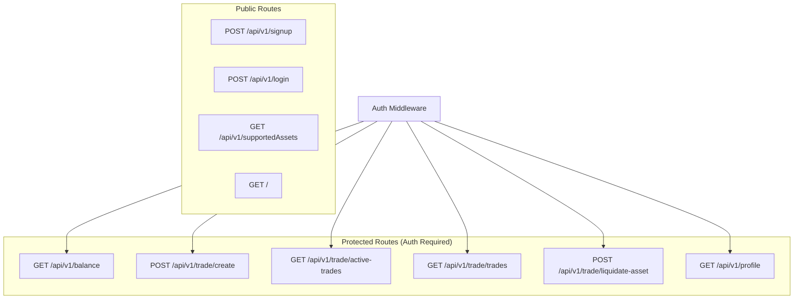

# Backend API Documentation

A comprehensive guide to the ReconElement Backend API for cryptocurrency trading platform.

---

## Overview

| Property | Value |
|----------|-------|
| **Base URL** | `http://localhost:4000` |
| **API Version** | `v1` |
| **Authentication** | JWT via HTTP-only Cookie (`JWT_bearer`) |
| **Content-Type** | `application/json` |

---

## Architecture Summary



---

## Data Models

### User

| Field | Type | Description |
|-------|------|-------------|
| `id` | `string (UUID)` | Unique user identifier |
| `email` | `string` | User's email (unique) |
| `username` | `string` | User's username (unique) |
| `password` | `string` | Hashed password |
| `name` | `string` | User's full name |
| `fund` | `number` | User's available balance (starts at $5000) |
| `deleted` | `boolean` | Soft delete flag |

### ExistingTrade

| Field | Type | Description |
|-------|------|-------------|
| `id` | `string (UUID)` | Unique trade identifier |
| `openPrice` | `number` | Price at which trade was opened |
| `closePrice` | `number` | Price at which trade was closed (0 if open) |
| `leverage` | `number` | Leverage multiplier (1, 2, 5, 10, 25, 100) |
| `assetPrice` | `number` | Price of individual asset at purchase time |
| `pnl` | `number` | Profit and Loss (0 until liquidated) |
| `quantity` | `number` | Quantity of asset purchased |
| `type` | `"long" \| "short"` | Trade direction |
| `assetId` | `number` | Reference to Asset (1=BTC, 2=ETH, 3=SOL) |
| `liquidated` | `boolean` | Whether trade has been liquidated |
| `userId` | `string` | Reference to User |

### Asset

| Field | Type | Description |
|-------|------|-------------|
| `id` | `number` | Unique asset ID (1=BTC, 2=ETH, 3=SOL) |
| `symbol` | `string` | Asset ticker symbol |
| `name` | `string` | Full asset name |
| `imageUrl` | `string` | URL to asset logo |
| `decimals` | `number` | Decimal precision (default: 4) |

---

## Authentication

The API uses **JWT (JSON Web Token)** authentication via HTTP-only cookies.

### How It Works

1. User logs in via `POST /api/v1/login`
2. Server sets `JWT_bearer` cookie (HTTP-only, 1 hour expiry)
3. All subsequent requests include this cookie automatically
4. Protected routes validate the token via auth middleware

> [!IMPORTANT]
> All routes under `/api/v1/balance`, `/api/v1/trade`, and `/api/v1/profile` require authentication. Requests without a valid JWT cookie will receive a `401 Unauthorized` response.

### Auth Error Response

```json
{
  "message": "Unauthorized, access denied"
}
```

---

## API Endpoints

---

## 1. Health Check

### `GET /`

Returns server status.

**Authentication:** None

#### Response

```json
{
  "message": "Hello to PORT: 4000 from Express server"
}
```

| Status | Description |
|--------|-------------|
| `200` | Server is running |

---

## 2. User Management

---

### `POST /api/v1/signup`

Creates a new user account.

**Authentication:** None

#### Request Body

| Field | Type | Required | Description |
|-------|------|----------|-------------|
| `firstname` | `string` | ✅ | User's first name |
| `lastname` | `string` | ✅ | User's last name |
| `email` | `string (email)` | ✅ | Valid email address |
| `username` | `string` | ✅ | Unique username |
| `password` | `string` | ✅ | User password |

#### Example Request

```json
{
  "firstname": "John",
  "lastname": "Doe",
  "email": "john.doe@example.com",
  "username": "johndoe",
  "password": "securePassword123"
}
```

#### Responses

**Success (200)**
```json
{
  "message": "User created successfully"
}
```

**Validation Error (404)**
```json
{
  "message": "Error occurred during API validation, please try again with valid parameters"
}
```

**Conflict (422)**
```json
{
  "message": "User with the same email or username already exists"
}
```

**Server Error (500)**
```json
{
  "message": "Internal Server Error"
}
```

---

### `POST /api/v1/login`

Authenticates a user and sets JWT cookie.

**Authentication:** None

#### Request Body

| Field | Type | Required | Description |
|-------|------|----------|-------------|
| `username` | `string` | ✅ | User's username |
| `password` | `string` | ✅ | User's password |

#### Example Request

```json
{
  "username": "johndoe",
  "password": "securePassword123"
}
```

#### Responses

**Success (200)**

Sets `JWT_bearer` cookie with the following properties:
- `httpOnly: true`
- `secure: false` (development mode)
- `maxAge: 3600` (1 hour)
- `path: '/'`

```json
{
  "message": "User found and authenticated"
}
```

**Validation Error (404)**
```json
{
  "message": "Error occurred during API validation, please try again with valid parameters"
}
```

**User Not Found (404)**
```json
{
  "message": "User not found with the provided credentials"
}
```

**Unauthorized (401)**
```json
{
  "message": "Unauthorized access, please provide the correct password"
}
```

**User Deleted (410)**
```json
{
  "message": "Requested user does not exist anymore"
}
```

**Server Error (500)**
```json
{
  "message": "Internal Server Error"
}
```

---

## 3. Profile

---

### `GET /api/v1/profile`

Returns the authenticated user's profile information.

**Authentication:** ✅ Required

#### Responses

**Success (200)**
```json
{
  "profile": {
    "email": "john.doe@example.com",
    "name": "John Doe",
    "username": "johndoe",
    "fund": 5000.00
  }
}
```

**User Deleted (204)**
```json
{
  "message": "User does not exist anymore"
}
```

**Not Found (404)**
```json
{
  "message": "User does not exist"
}
```

**Server Error (500)**
```json
{
  "message": "Internal Server Error"
}
```

---

## 4. Balance

---

### `GET /api/v1/balance`

Returns the user's current fund balance.

**Authentication:** ✅ Required

#### Responses

**Success (200)**
```json
{
  "message": "5000.000"
}
```

> [!NOTE]
> The balance is returned as a string with 3 decimal places precision.

---

## 5. Supported Assets

---

### `GET /api/v1/supportedAssets`

Returns list of supported cryptocurrency assets for trading.

**Authentication:** None

#### Responses

**Success (200)**
```json
{
  "assets": [
    {
      "symbol": "BTC",
      "name": "Bitcoin",
      "imageUrl": "https://bitcoin.org/img/icons/logotop.svg?1749679667"
    },
    {
      "symbol": "ETH",
      "name": "Ethereum",
      "imageUrl": "https://ethereum.org/favicon.ico"
    },
    {
      "symbol": "SOL",
      "name": "Solana",
      "imageUrl": "https://solana.com/favicon.svg"
    }
  ]
}
```

---

## 6. Trading

---

### `POST /api/v1/trade/create`

Creates a new trade order.

**Authentication:** ✅ Required

#### Request Body

| Field | Type | Required | Allowed Values | Description |
|-------|------|----------|----------------|-------------|
| `asset` | `string` | ✅ | `"BTC"`, `"ETH"`, `"SOL"` | Asset to trade |
| `type` | `string` | ✅ | `"long"`, `"short"` | Trade direction |
| `leverage` | `number` | ✅ | `1`, `2`, `5`, `10`, `25`, `100` | Leverage multiplier |
| `quantity` | `number` | ✅ | Any positive number | Quantity to buy |
| `slippage` | `number` | ✅ | Any number | Slippage in bips (1 bip = 0.01%) |

#### Example Request

```json
{
  "asset": "BTC",
  "type": "long",
  "leverage": 5,
  "quantity": 0.5,
  "slippage": 1
}
```

#### Responses

**Success (200)**
```json
{
  "message": "Order placed successfully"
}
```

**Validation Error (404)**
```json
{
  "message": "Error occurred during API validation, please try again with valid parameters"
}
```

**Invalid Asset (400)**
```json
{
  "message": "No asset of this name exists"
}
```

**Invalid Order Type (400)**
```json
{
  "message": "No order of this type exists"
}
```

**Invalid Leverage (400)**
```json
{
  "message": "No such leverage exists"
}
```

**No Funds (400)**
```json
{
  "message": "No funds found with user"
}
```

**Server Error (500)**
```json
{
  "message": "Internal Server Error"
}
```

---

### `GET /api/v1/trade/active-trades`

Returns all **non-liquidated** trades for the authenticated user.

**Authentication:** ✅ Required

#### Responses

**Success (200)**
```json
{
  "message": [
    {
      "id": "550e8400-e29b-41d4-a716-446655440000",
      "openPrice": 45000.00,
      "closePrice": 0,
      "leverage": 5,
      "pnl": 0,
      "assetId": 1,
      "liquidated": false,
      "userId": "user-uuid-here",
      "assetPrice": 90000.00,
      "quantity": 0.5,
      "type": "long"
    }
  ]
}
```

> [!NOTE]
> Only trades with `liquidated: false` are returned.

**Server Error (500)**
```json
{
  "message": "Internal Server Error"
}
```

---

### `GET /api/v1/trade/trades`

Returns **all** trades (both active and liquidated) for the authenticated user.

**Authentication:** ✅ Required

#### Responses

**Success (200)**
```json
{
  "message": [
    {
      "id": "550e8400-e29b-41d4-a716-446655440000",
      "openPrice": 45000.00,
      "closePrice": 46000.00,
      "leverage": 5,
      "pnl": 1000.00,
      "assetId": 1,
      "liquidated": true,
      "userId": "user-uuid-here",
      "assetPrice": 90000.00,
      "quantity": 0,
      "type": "long"
    },
    {
      "id": "660e8400-e29b-41d4-a716-446655440001",
      "openPrice": 3000.00,
      "closePrice": 0,
      "leverage": 2,
      "pnl": 0,
      "assetId": 2,
      "liquidated": false,
      "userId": "user-uuid-here",
      "assetPrice": 3200.00,
      "quantity": 1.5,
      "type": "short"
    }
  ]
}
```

**Server Error (500)**
```json
{
  "message": "Internal Server Error"
}
```

---

### `POST /api/v1/trade/liquidate-asset`

Liquidates (sells) a specific quantity of an existing trade.

**Authentication:** ✅ Required

#### Request Body

| Field | Type | Required | Description |
|-------|------|----------|-------------|
| `id` | `string (UUID)` | ✅ | Trade ID to liquidate |
| `quantity` | `number` | ✅ | Quantity to sell |

#### Example Request

```json
{
  "id": "550e8400-e29b-41d4-a716-446655440000",
  "quantity": 0.25
}
```

#### Responses

**Success (200)**
```json
{
  "message": "Trade has been successfully liquidated"
}
```

**Validation Error (404)**
```json
{
  "message": "Error occurred during API validation, please provide the input id of the order correctly"
}
```

**Quantity Exceeds Purchased (400)**
```json
{
  "message": "Invalid request, the quantity provided to be sold exceeds the purchased quantity with this order id"
}
```

**Already Liquidated (400)**
```json
{
  "message": "Invalid request, the trade with this order id has already been liquidated"
}
```

**Trade Not Found (404)**
```json
{
  "message": "No trades found with the provided id"
}
```

**Server Error (500)**
```json
{
  "message": "Internal Server Error"
}
```

> [!TIP]
> Partial liquidation is supported. If you sell less than the total quantity, the trade remains open with the remaining quantity. The trade is marked as fully liquidated only when `quantity` reaches 0.

---

## Error Handling Summary

| Status Code | Meaning |
|-------------|---------|
| `200` | Success |
| `204` | No Content (soft-deleted user) |
| `400` | Bad Request (invalid parameters) |
| `401` | Unauthorized (missing/invalid JWT) |
| `404` | Not Found / Validation Error |
| `410` | Gone (deleted resource) |
| `422` | Unprocessable Entity (conflict) |
| `500` | Internal Server Error |

---

## Frontend Integration Guide

### Setting Up API Client

```typescript
// Example using fetch with credentials
const API_BASE = 'http://localhost:4000/api/v1';

const api = {
  async signup(data: SignupRequest) {
    const res = await fetch(`${API_BASE}/signup`, {
      method: 'POST',
      headers: { 'Content-Type': 'application/json' },
      body: JSON.stringify(data),
      credentials: 'include' // Important for cookies
    });
    return res.json();
  },

  async login(data: LoginRequest) {
    const res = await fetch(`${API_BASE}/login`, {
      method: 'POST',
      headers: { 'Content-Type': 'application/json' },
      body: JSON.stringify(data),
      credentials: 'include' // Important for cookies
    });
    return res.json();
  },

  async getProfile() {
    const res = await fetch(`${API_BASE}/profile`, {
      credentials: 'include'
    });
    return res.json();
  },

  async getBalance() {
    const res = await fetch(`${API_BASE}/balance`, {
      credentials: 'include'
    });
    return res.json();
  },

  async getActiveTrades() {
    const res = await fetch(`${API_BASE}/trade/active-trades`, {
      credentials: 'include'
    });
    return res.json();
  },

  async getAllTrades() {
    const res = await fetch(`${API_BASE}/trade/trades`, {
      credentials: 'include'
    });
    return res.json();
  },

  async createTrade(data: CreateTradeRequest) {
    const res = await fetch(`${API_BASE}/trade/create`, {
      method: 'POST',
      headers: { 'Content-Type': 'application/json' },
      body: JSON.stringify(data),
      credentials: 'include'
    });
    return res.json();
  },

  async liquidateTrade(data: LiquidateRequest) {
    const res = await fetch(`${API_BASE}/trade/liquidate-asset`, {
      method: 'POST',
      headers: { 'Content-Type': 'application/json' },
      body: JSON.stringify(data),
      credentials: 'include'
    });
    return res.json();
  },

  async getSupportedAssets() {
    const res = await fetch(`${API_BASE}/supportedAssets`);
    return res.json();
  }
};
```

### TypeScript Types

```typescript
// Request Types
interface SignupRequest {
  firstname: string;
  lastname: string;
  email: string;
  username: string;
  password: string;
}

interface LoginRequest {
  username: string;
  password: string;
}

interface CreateTradeRequest {
  asset: 'BTC' | 'ETH' | 'SOL';
  type: 'long' | 'short';
  leverage: 1 | 2 | 5 | 10 | 25 | 100;
  quantity: number;
  slippage: number;
}

interface LiquidateRequest {
  id: string; // UUID
  quantity: number;
}

// Response Types
interface Profile {
  email: string;
  name: string;
  username: string;
  fund: number;
}

interface Trade {
  id: string;
  openPrice: number;
  closePrice: number;
  leverage: number;
  pnl: number;
  assetId: number;
  liquidated: boolean;
  userId: string;
  assetPrice: number;
  quantity: number;
  type: 'long' | 'short';
}

interface Asset {
  symbol: string;
  name: string;
  imageUrl: string;
}

interface SupportedAssetsResponse {
  assets: Asset[];
}

interface ProfileResponse {
  profile: Profile;
}

interface TradesResponse {
  message: Trade[];
}

interface MessageResponse {
  message: string;
}
```

---

## Suggested Frontend Pages

Based on the API structure, here are the recommended pages:

| Page | Route | Description |
|------|-------|-------------|
| **Landing** | `/` | Marketing/info page |
| **Login** | `/login` | User authentication |
| **Signup** | `/signup` | User registration |
| **Dashboard** | `/dashboard` | Overview with balance, active trades |
| **Profile** | `/profile` | User profile management |
| **Trade** | `/trade` | Trading interface |
| **History** | `/history` | All trades history |

---

## CORS Configuration

The backend is configured with the following CORS settings:

- **Allowed Origins**: Currently allows all origins (development mode)
- **Credentials**: Enabled (required for cookie-based auth)

> [!WARNING]
> For production, update the `allowList` in `index.ts` to include only your frontend domain(s).

---

## Dependencies & Infrastructure

| Component | Technology |
|-----------|------------|
| **Framework** | Express.js v5 |
| **Database** | PostgreSQL (via Prisma ORM) |
| **Cache/Queue** | Redis (for trade processing) |
| **Authentication** | JWT (jsonwebtoken) |
| **Validation** | Zod v4 |
| **Password Hashing** | bcrypt |
